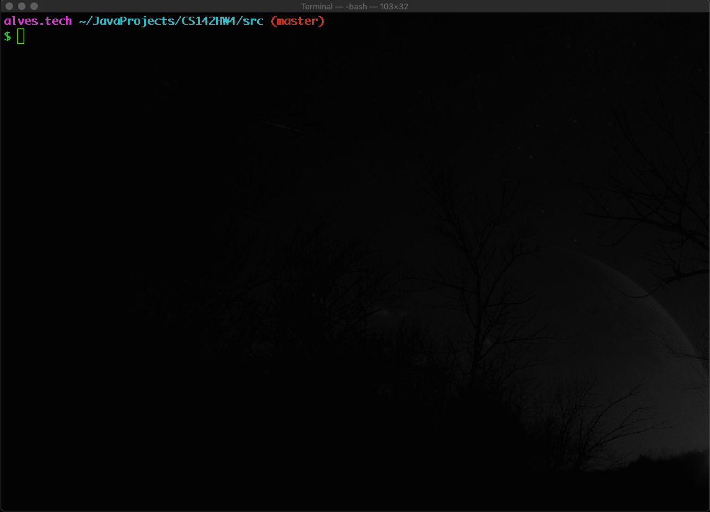
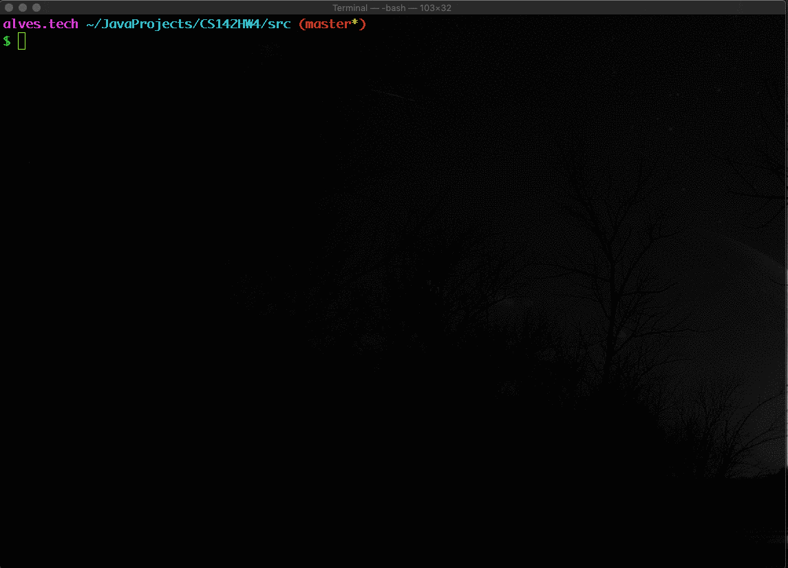
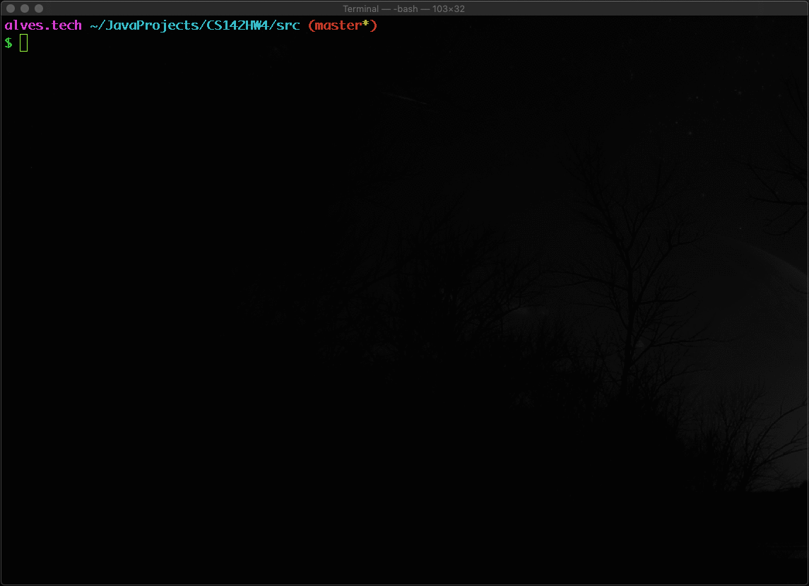

# CS142 Project 4

## XML File Reader

This Programs will be used to read XML file and display results on console

## Output samples:

  * `ReadXMLOne.java`

  

  * `ReadXMLTwo.java`

  

  * `ReadUnknownXMLStructure.java`

  